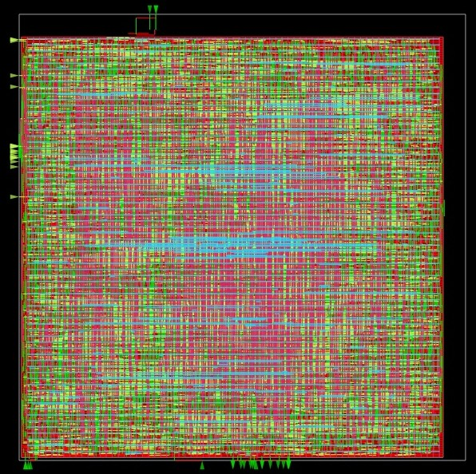

# Synthesis_flow_opensource_iverilog_GTK_yosys

This project follows a standard open-source digital design flow from RTL → Synthesis → STA → Physical Design (GDS).
The files used at each stage are listed below.

🔹 1. **RTL Level (Design & Simulation)**
These files define the design and verify functionality before synthesis.
  64b_memory.v
  RTL Verilog description of the 64-bit memory design.

  tb_64b_memory.v
  Testbench used to simulate and validate the RTL behavior.

  sim.vvp
  Compiled simulation output generated by Icarus Verilog.

  SRAM.vcd
  VCD waveform file generated during simulation for signal inspection.

🔹 2.** RTL Synthesis (Yosys)**
These files are used to synthesize the RTL into a gate-level netlist.

  64b_memory_yosys.tcl
  Yosys synthesis script controlling the RTL-to-gate synthesis flow.

  synth_64b_memory.v
  Gate-level synthesized netlist generated by Yosys.

🔹 3. **Static Timing Analysis (OpenSTA)
T**hese files are used to verify timing of the synthesized netlist.

  sta_64b_memory.tcl
  OpenSTA timing analysis script.

  synth_64b_memory.sdc
  Timing constraints file (clocks, I/O delays, etc.) for STA.

🔹 4. **Physical Design & GDS Generation (OpenROAD)**
These files drive the full physical design flow, including placement, routing, and GDS generation.

  openroad_64b_memory.tcl
  Main OpenROAD script for floorplanning, placement, CTS, routing, and signoff.

  openroad_main_64b_memory.tcl
  Top-level wrapper script that orchestrates the OpenROAD flow.

  openroad_64b_memory.log
  Log file capturing the complete OpenROAD execution details.

  

16 KB memory implemented using the available digital library in the Google SkyWater 130 nm PDK. The maximum clock frequency is approximately 40 MHz
(full details yet to update).

